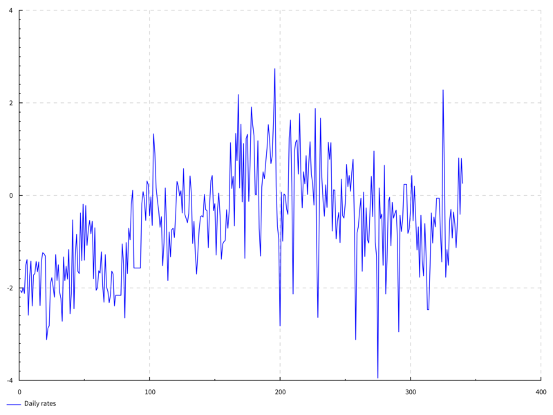
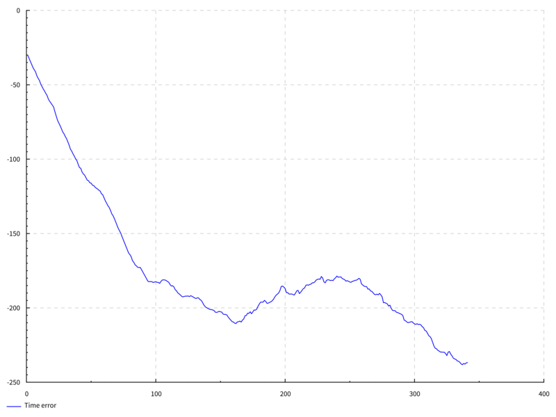
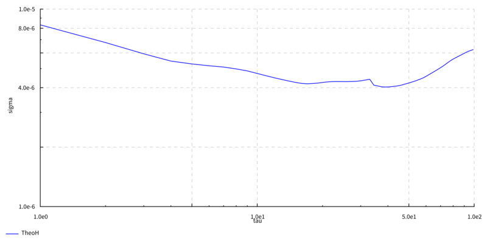

# Example Data

## Arnold #36 (`arnold36.csv`)

The 1779/80 Greenwich trial of
[John Arnold's pocket chronometer #36](http://collections.rmg.co.uk/collections/objects/207131.html).
Data taken from:

* Arnold, John.  1780.  *An Account kept during Thirteen Months in the
  Royal Observatory at Greenwich, of the Going of a Pocket
  Chronometer, made on a New Construction, by John Arnold, having his
  new-invented Balance Spring, and a Compensation for the Effects of
  Heat and Cold in the Balance.  Published by Permission of the Board
  of Longitude.*  London: John Arnold, No. 2 Adam-Street, Adelphi.
  Accessed online (Jan. 2016) at: http://cudl.lib.cam.ac.uk/view/PR-UNCAT-00005

The data are time errors recorded in seconds, and go from March 26,
1779 to February 29, 1780.  The report shows both frequency and time
errors, which provides redundancy against errors.  I entered both into
a spreadsheet and checked them against each other; I found a handful
of errors which I fixed to the best of my judgement.  None of the
errors amounted to more than 1.1 seconds, and they cancel out.  (The
errors are phase noise, not frequency noise, after all.)

The chronometer was compared to the transit clock (presumably
[George Graham's No. 3](http://collections.rmg.co.uk/collections/objects/203202.html)),
which was rated to keep sidereal time, and the readings were corrected
about once a week for mean time and the observed error of the transit
clock.  The transit clock's error was computed irregularly about every
7 days, and its rates were assumed to be constant between
calibrations, so values for sampling periods lower than say 10 days
are questionable.

There are a few gaps where Greenwich did not record rates for the
watch for some days.  In their analysis the way they handled this was
to assume that the watch kept a perfectly steady rate during the gap.
This can be seen as "flat" valleys or peaks in the daily rate chart.
The gaps are all relatively short, so again, they likely don't
contribute much to the result.

In any case, the most important thing about this data isn't the exact
value of the deviation at any one sampling interval.  What I'm
interested in here is:

1. The approximate inflection points the stability curve;
2. The order of magnitude of the stability values.

So the TheoH chart suggests this watch could keep its initial rate to
within about 30 seconds (2 standard deviations) for 40 days, but for
periods longer than that its rates went on a random walk or a
deterministic drift.

## Earth Rotation, 1962-2015

The data is taken from here:

* http://www.iers.org/IERS/EN/DataProducts/EarthOrientationData/eop.html

The parameter that's of interest to us is "LOD" (length of day).  This
value is the excess length of each recorded mean solar day, relative
to 86,400 atomic seconds.  This value is thus a frequency error data
series.

